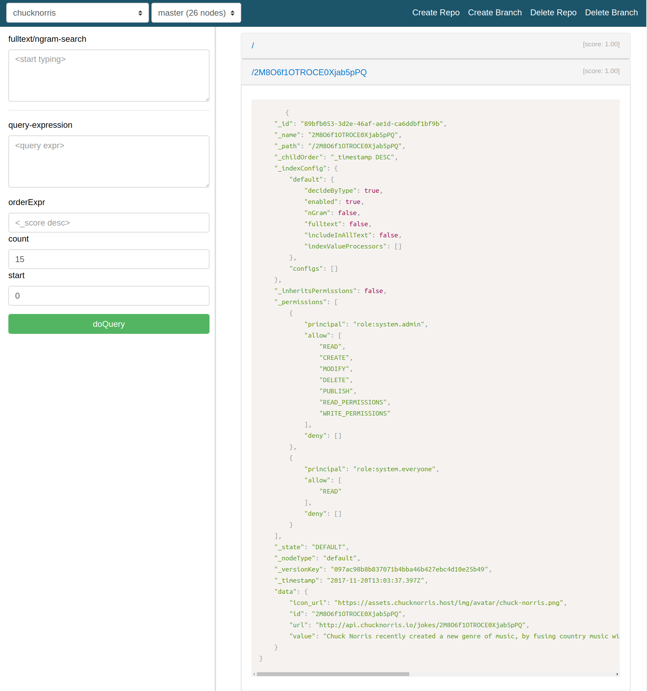

# Data PULL

A library for pulling data from resources into an Enonic XP repository to be used in an APP for easy access and search.

When developing APPs you often need some external data to search in or
add to your app. This library can be used to pull data from a JSON HTTP
resource and store them in an existing or a new repository.

The library can be used for and have been used to:

-   Synchronize/pull data from an existing endpoint and into an repository in Enonic XP for easy use with index and permission config.

-   Migrating data to Enonic XP.

-   Synchronize data between internal and external zones.

-   Create repositories when needed by config.

-   ....

Table of Contents:

- [Data PULL](#markdown-header-data-pull)
    - [Usage](#markdown-header-usage)
        - [Enonic XP version >=6.12](#markdown-header-enonic-xp-version-612)
        - [Enonic XP version <=6.11](#markdown-header-enonic-xp-version-611)
- [Example and feature application](#markdown-header-example-and-feature-application)
    - [Getting started example: Chuck Norris Facts](#markdown-header-getting-started-example-chuck-norris-facts)
    - [Pull](#markdown-header-pull)
    - [Store](#markdown-header-store)
    - [Result](#markdown-header-result)
    - [Result in repository. One node example.](#markdown-header-result-in-repository-one-node-example)
    - [Screenshot from RepoXplorer](#markdown-header-screenshot-from-repoxplorer)
- [JSON Configuration model](#markdown-header-json-configuration-model)

## Usage

To install this library you need to update your build.gradle file.

### Enonic XP version >=6.12

    dependencies {
        include "com.enonic.xp:lib-node:${xpVersion}"
        include "com.enonic.xp:lib-repo:${xpVersion}"
        include "com.enonic.lib:lib-http-client:1.0.0"

        include 'openxp.lib:data-pull:0.9.4'
    }

### Enonic XP version <=6.11

    repositories {
        maven {
          url 'https://dl.bintray.com/openxp/enonic'
        }
    }

    dependencies {
         include 'openxp.lib:data-pull:0.9.4'
    }

# Example and feature application

An example application is created to testing purpose from the examples. The
application can be downloaded and installed on a test server:
<https://github.com/rbrastad/data-pull/blob/master/build/DataPullExamples.jar?raw=true>

Install and access the application on URL: SERVER_HOSTNAME/app/openxp.app.data.pull.examples

The application is built for version +6.12.0

All example code can be found here:
<https://bitbucket.org/openxp/lib-data-pull/src/master/data-pull-examples/src/main/resources/controller/pull/?at=master>

The complete JSON configuration can be found here: [JSON Configuration model](#markdown-header-json-configuration-model)

## Getting started example: Chuck Norris Facts

The complete example can be viewed here:
<https://bitbucket.org/openxp/lib-data-pull/src/master/data-pull-examples/src/main/resources/controller/pull/chuck-norris.js?at=master&fileviewer=file-view-default>

The configuration shows how you can get and store Chuck Norris facts in an repository on Enonic XP. 

We are getting Chuck Norris facts from: <https://api.chucknorris.io/jokes/search?query=music> a subset of the result is shown below.

    {
        total: 25,
        result: [
                {
                    category: null,
                    icon_url: "https://assets.chucknorris.host/img/avatar/chuck-norris.png",
                    id: "2M8O6f1OTROCE0Xjab5pPQ",
                    url: "http://api.chucknorris.io/jokes/2M8O6f1OTROCE0Xjab5pPQ",
                    value: "Chuck Norris recently created a new genre of music, by fusing country music with East Coast gansta rap and Swedish death metal while incorporating elements of Tibetian throat-singing. He calls it Norrisound."
                },
                {
                    category: null,
                    icon_url: "https://assets.chucknorris.host/img/avatar/chuck-norris.png",
                    id: "K6Cv7y9MTjaTsc8ynm91AA",
                    url: "http://api.chucknorris.io/jokes/K6Cv7y9MTjaTsc8ynm91AA",
                    value: "chuck norris can play angry birds, listen to music and watch movies on a pay-phone... and all for free"
                },...

Data PULL uses a JSON configuration for pulling and storing data. The
configuration contains of two parts for this configuration.

-   Pull, Where is the data going to be pulled from.

-   Store, Where is data going to be stored

The configuration below is the full configuration for the request pull and storing of facts from <https://api.chucknorris.io/jokes/search?query=music>.

    // Include data pull into the JS file.
    var dataPull = require("/lib/openxp/data-pull");

    // Create a configuration.
    var dataPullConfig = {
            // pull parent node
            pull : {
                // https://enonic-docs.s3.amazonaws.com/com.enonic.lib/lib-http-client/index.html
                request: {
                    url: "https://api.chucknorris.io/jokes/search?query=music",
                    method: "GET"
                },
                response: {
                    // where in the request result json is data to be saved. if nested use dot. example: response.data.result
                    dataPath: 'result'
                }
            },
            // store parent node. Where and how to store pull request data
            store : {
                node : {
                    // the field used as ID from a result node  
                    nameField:"id" 
                },
                repo : {
                    // http://repo.enonic.com/public/com/enonic/xp/docs/6.11.0/docs-6.11.0-libdoc.zip!/module-node.html#.connect
                    connect : {
                        repoId: "chucknorris",
                        branch: "master"
                    },
                    // http://repo.enonic.com/public/com/enonic/xp/docs/6.11.0/docs-6.11.0-libdoc.zip!/module-repo.html#.create
                    create :{
                        id: "chucknorris"
                    }
                }
            }
        };

    // execute the configuration
    var result = dataPull.pullDataByConfig( dataPullConfig );

## Pull

When we want to get som external http json data. We need to use a pull request node configuration. If we then need to get some data inside that json structure. We need to add a response configuration node and add where the data is found.   

TThe request node uses the same configuration as http-client library request and is configured the same way.  https://enonic-docs.s3.amazonaws.com/com.enonic.lib/lib-http-client/index.html

The config below tells us that we are going to get data from https://api.chucknorris.io/jokes/search?query=music and that the data returned from the response is in the result node of the JSON response. 

    pull : {
        request: {
            url: "https://api.chucknorris.io/jokes/search?query=music",
            method: "GET"
        },
        response: {
          dataPath: 'result'
        }
    },

##  Store

When data is going to be stored we need to tell where and how to store
the data. This is done in the store configuration node. 

The config below tell us that data returned from the pull response is going to be saved in the chucknorris repo and in the master branch. If the repo does not exist. We will create it and name it chucknorris. If no branch is present in store.repo.create the default branch is master.  

    // store parent node. Where and how to store pull request data
    store : {
        // Node configuration. How to create
        node : {
            nameField:"id" // the ID field in a result node  
        },
        repo : {
            // The repo and branch to connect to.
            // http://repo.enonic.com/public/com/enonic/xp/docs/6.11.0/docs-6.11.0-libdoc.zip!/module-node.html#.connect
            connect : {
                repoId: "chucknorris",
                branch: "master"
            },
            // The name of the repo to create
            // http://repo.enonic.com/public/com/enonic/xp/docs/6.11.0/docs-6.11.0-libdoc.zip!/module-repo.html#.create
            create :{
                id: "chucknorris"
            }
        }

## Result

When a data pull is finished it returns an result that is a summary of what has been created, modified , errors...

Example of the default result from dataPull.pullDataByConfig( dataPullConfig ) in the library.

    {
        "dataPullConfig": {
            "pull": {
                "request": {
                    "url": "https://api.chucknorris.io/jokes/search?query=music",
                    "method": "GET"
                }
            },
            "store": {
                "node": {
                "nameField": "id"
            },
            "repo": {
                    "connect": {
                    "repoId": "chucknorris",
                    "branch": "master"
                },
                "create": {
                    "id": "chucknorris"
                }
            }
        }
    },
    "result": {
        "pull": {},
        "store": {
            "saved": [
                {
                "_id": "89bfb053-3d2e-46af-ae1d-ca6ddbf1bf9b",
                "_name": "2M8O6f1OTROCE0Xjab5pPQ",
                "_path": "/2M8O6f1OTROCE0Xjab5pPQ",
                "_timestamp": "2017-11-20T13:03:37.397Z"
                },
                {
                "_id": "f930e97e-27d6-47e1-8299-64038dfe3f47",
                "_name": "K6Cv7y9MTjaTsc8ynm91AA",
                "_path": "/K6Cv7y9MTjaTsc8ynm91AA",
                "_timestamp": "2017-11-20T13:03:37.423Z"
                },....
            ],
            "error": []
            }
        }
    }
    

## Result in repository. One node example.

    {
        "_id": "89bfb053-3d2e-46af-ae1d-ca6ddbf1bf9b",
        "_name": "2M8O6f1OTROCE0Xjab5pPQ",
        "_path": "/2M8O6f1OTROCE0Xjab5pPQ",
        "_childOrder": "_timestamp DESC",
        "_indexConfig": {
            "default": {
                "decideByType": true,
                "enabled": true,
                "nGram": false,
                "fulltext": false,
                "includeInAllText": false,
                "indexValueProcessors": []
            },
            "configs": []
        },
        "_inheritsPermissions": false,
        "_permissions": [
            {
                "principal": "role:system.authenticated",
                    "allow": [
                        "READ",
                        "CREATE",
                        "MODIFY",
                        "PUBLISH"
                    ],
                    "deny": []
            },
            {
                "principal": "role:system.everyone",
                "allow": [
                    "READ"
                ],
                "deny": []
            }
        ],
        "_state": "DEFAULT",
        "_nodeType": "default",
        "_versionKey": "097ac98b8b837071b4bba46b427ebc4d10e25b49",
        "_timestamp": "2017-11-20T13:03:37.397Z",
        "data": {
            "icon_url": "https://assets.chucknorris.host/img/avatar/chuck-norris.png",
            "id": "2M8O6f1OTROCE0Xjab5pPQ",
            "url": "http://api.chucknorris.io/jokes/2M8O6f1OTROCE0Xjab5pPQ",
            "value": "Chuck Norris recently created a new genre of music, by fusing country music with East Coast gansta rap and Swedish death metal while incorporating elements of Tibetian throat-singing. He calls it Norrisound."
        }
    }

## Screenshot from RepoXplorer

# JSON Configuration model

JSON configuration model used by Data PULL.

    var config = {
        pull: {
            request: {
                url: 'https://restcountries.eu/rest/v2/all',
                method: 'GET'
            },
            response: {
                dataPath : 'result',
                editor : function(requestResult, dataPullConfig) {
                    return requestResult.result;
                },
                dataSlice: {
                    limit: 5,
                    start: 0
                }
            }
        },
        store: {
            node: {
                nameField: 'id'
                editor: function(nodeData, pullData, node, dataPullConfig) {
                    return nodeData // return nodeData or node ;
                },
                _parentPath : 'mypath/path2'
                _indexConfig: {
                    default: {
                        decideByType: true,
                        enabled: true,
                        nGram: true,
                        fulltext: true,
                        includeInAllText: true,
                        indexValueProcessors: []
                    }
                },
                _permissions: [
                    {
                        "principal": "role:system.authenticated",
                        "allow": [
                            "READ",
                            "CREATE",
                            "MODIFY",
                            "PUBLISH"
                        ],
                        "deny": []
                    }
                ],
                _childOrder: "_timestamp DESC",
                _indexConfig: {
                    default": {
                        "decideByType": false,
                        "enabled": true,
                        "nGram": false,
                        "fulltext": false,
                        "includeInAllText": false,
                        "path": false,
                        "indexValueProcessors": []
                    }
                }
            },
            repo: {
                connect: {
                    repoId: 'countries-custom-no-node-name',
                    branch: 'custom-branch'
                },
                create: {
                    id: 'countries-custom-no-node-name'
                },
                createBranch: {
                    branchId: 'custom-branch',
                    repoId: 'countries-custom-no-node-name'
                }
            },
            // Do something with the response before returning it.
            result: {
                editor: function(response) {
                    log.info('Result response editor do something with the response here or just return it');
    
                    return response.result.store;
                }
            }
        }
	};

**pull.request**

The request node uses the same configuration as http-client library and
uses the same configuration. 

https://enonic-docs.s3.amazonaws.com/com.enonic.lib/lib-http-client/index.html

**pull.request.response**

pull response parent node.

**pull.response.dataPath**

Data returned from the request is JSON som we need to tell where we can
find data to save

**pull.response.editor**

An editor function with the request response and data pull config parameter as in parameters. Returns data to be used in response or store.

**pull.response.dataSlice**

Slice data to easy limit the amount of data to be returned. Used primarilly for developing and testing. 

**store.node**

The node configuration says how we are going to store each node in the
response.

**store.node.nameField**

The nameField maps the name value in the node with this value to the
name field of node in the repo. The field can later be used as an unique
ID field for querys and updating data.

**store.node.editor**

Editor for customizing data when creating or modifying a node.

**store.node._parentPath**

Parent path to save the node in. parent path are autmatically created if they do not exist.

**store.node._indexConfig**

Index configuration for the node to be created.

http://repo.enonic.com/public/com/enonic/xp/docs/6.11.0/docs-6.11.0-libdoc.zip!/module-node-RepoConnection.html#create

**store.node._permissions**

Permissions configuration for the node to be created.

http://repo.enonic.com/public/com/enonic/xp/docs/6.11.0/docs-6.11.0-libdoc.zip!/module-node-RepoConnection.html#create

**store.node._childOrder**

Childorder configuration for the node to be created.

http://repo.enonic.com/public/com/enonic/xp/docs/6.11.0/docs-6.11.0-libdoc.zip!/module-node-RepoConnection.html#create . 
                        

**store.node._indexConfig**

Index configuration configuration for the node to be created.

http://repo.enonic.com/public/com/enonic/xp/docs/6.11.0/docs-6.11.0-libdoc.zip!/module-node-RepoConnection.html#create   

**store.repo**

Where is the data going to be stored. The configuration for the repo
node uses the same configuration found in RepoConnection, repo
and Node library for creating and connecting to a repository.

**store.repo.connect**

Uses the same configuration as in the repo create library
 
http://repo.enonic.com/public/com/enonic/xp/docs/6.11.0/docs-6.11.0-libdoc.zip!/module-node.html#.connect

**store.repo.create**

Uses the same configuration as in the repo create library

http://repo.enonic.com/public/com/enonic/xp/docs/6.11.0/docs-6.11.0-libdoc.zip!/module-repo.html#.create

**store.repo.createBranch**

Uses the same configuration as in the repo create branch library

http://repo.enonic.com/public/com/enonic/xp/docs/6.11.0/docs-6.11.0-libdoc.zip!/module-repo.html#.createBranch

**result.editor**

Editor for customizing data before returning it.

